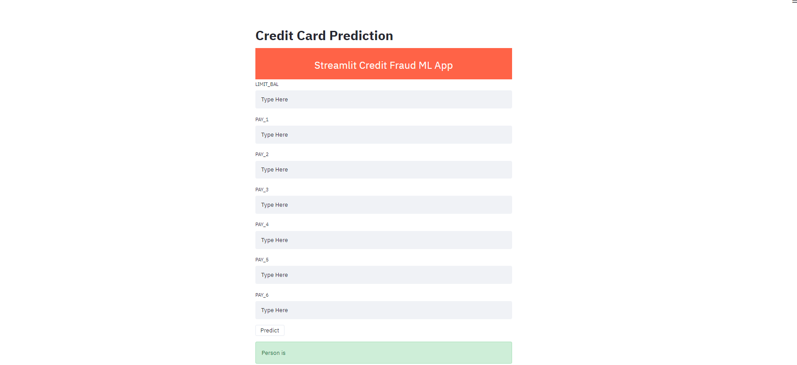
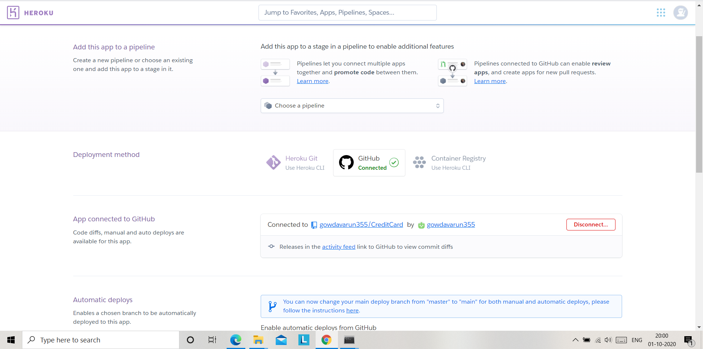

# Credit Card default prediction


# Contents

- Demo
- Dataset Information
- Installation
- Technical Aspect
- Write Streamlit App
- Procfile
- Create requirements.txt
- setup.sh
- Deployment in local machine using streamlit
- Deployment of machine learning model in Heroku using Streamlit

# Demo

Link: https://datacredit.herokuapp.com/



# Dataset Information

This dataset contains information on default payments, demographic factors, credit data, history of payment, and bill statements of credit card clients

Content
There are 25 variables:

- ID: ID of each client
- LIMIT_BAL: Amount of given credit in NT dollars (includes individual and family/supplementary credit
- SEX: Gender (1=male, 2=female)
- EDUCATION: (1=graduate school, 2=university, 3=high school, 4=others, 5=unknown, 6=unknown)
- MARRIAGE: Marital status (1=married, 2=single, 3=others)
- AGE: Age in years
- PAY_0: Repayment status in September, 2005 (-1=pay duly, 1=payment delay for one month, 2=payment delay for two months, … 8=payment delay for eight months, 9=payment delay for nine months and above)
- PAY_2: Repayment status in August, 2005 (scale same as above)
- PAY_3: Repayment status in July, 2005 (scale same as above)
- PAY_4: Repayment status in June, 2005 (scale same as above)
- PAY_5: Repayment status in May, 2005 (scale same as above)
- PAY_6: Repayment status in April, 2005 (scale same as above)
- BILL_AMT1: Amount of bill statement in September, 2005 (NT dollar)
- BILL_AMT2: Amount of bill statement in August, 2005 (NT dollar)
- BILL_AMT3: Amount of bill statement in July, 2005 (NT dollar)
- BILL_AMT4: Amount of bill statement in June, 2005 (NT dollar)
- BILL_AMT5: Amount of bill statement in May, 2005 (NT dollar)
- BILL_AMT6: Amount of bill statement in April, 2005 (NT dollar)
- PAY_AMT1: Amount of previous payment in September, 2005 (NT dollar)
- PAY_AMT2: Amount of previous payment in August, 2005 (NT dollar)
- PAY_AMT3: Amount of previous payment in July, 2005 (NT dollar)
- PAY_AMT4: Amount of previous payment in June, 2005 (NT dollar)
- PAY_AMT5: Amount of previous payment in May, 2005 (NT dollar)
- PAY_AMT6: Amount of previous payment in April, 2005 (NT dollar)
- default.payment.next.month: Default payment (1=yes, 0=no)

# Installation

To install the required packages and libraries, run this command in the project directory after cloning the repository:

```diff
pip install -r requirements.txt
```

# Technical Aspect

```diff
1)Data Cleaning
1.1) Finding Out missing values
1.1) Finding out Outliers 
2) Data Exploration
3) Feature Engineering
3.1) One hot encoding
4) Feature Selection
5) Algorithm 
5.1) Logistic Regression
(-)Imbalanced data in dataset so performing undersampling,oversampling and smote
5.2) Random Forest hyper parameter tuning 
6) Create and Pickle a Machine Learning Model
```
```diff
Used classification machine algorithms such as Logistic Regression and Random Forest but Random Forest performed very well.Random Forest using hyper parameter technique got the better result such as precison,recall,accuracy=83%,confusion matrix.
```

```diff
import pickle
pickle.dump(model, open(‘model.pkl’, ‘wb’))
```

# Write Streamlit App

Open up your jupyter notebook and create a new .py file inside the working directory named app.py

The structure of the code follows:

```diff
Load pickled model
Name Streamlit app
The route to predict is created in app.py and even template is created in app.py only
```
# Procfile
A Procfile specifies the commands that are executed by a Heroku app on startup. To create one, open up a new file named Procfile (no extension) in the working directory and paste the following. streamlit command to run our app

```diff
  web: sh setup.sh && streamlit run app.py
```

# Create requirements.txt
```diff
The requirements.txt file will contain all of the dependencies for the flask app. To create a requirements.txt, run the following in your terminal from the working directory:
```

# setup.sh
```diff
Moving on to setup.sh, we will create the file the same way we created the last two, by creating a new txt file in Jupyter Notebook. By the way, don’t forget to rename your files with the appropriate extensions. setup.sh, like requirements.txt helps create the necessary environment for our streamlit app to run.
```

# Deployment in local machine using Streamlit

```diff
streamlit run -- app.py
```

# Deployment of machine learning model in Heroku using Streamlit


1) First Create app name
2) Make sure it is connected to GitHub

3) Then click press on Deploy


